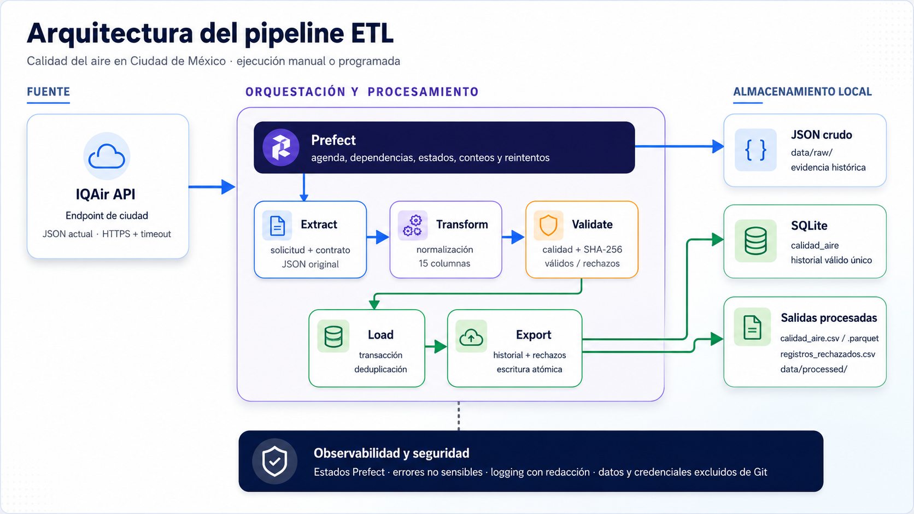
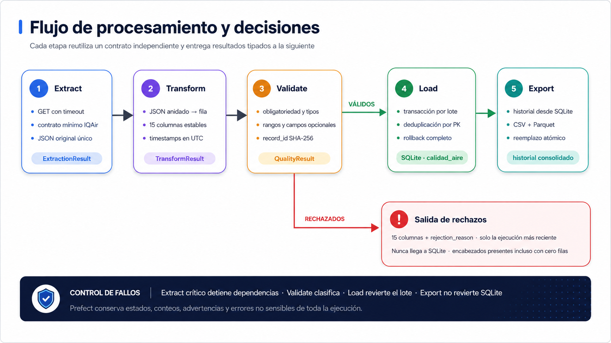

# Pipeline ETL de Calidad del Aire en Ciudad de México

Pipeline de datos en Python que consulta las condiciones actuales de calidad del aire y clima de IQAir, conserva la respuesta original, normaliza y valida el registro, mantiene un historial idempotente en SQLite y publica salidas en CSV y Parquet. Prefect coordina el flujo completo y su ejecución local programada.

## Problema y objetivo

Los datos actuales de calidad del aire llegan como JSON anidado, pueden contener campos opcionales y requieren controles antes de utilizarse para análisis. Este proyecto resuelve ese recorrido de extremo a extremo:

- conserva la respuesta cruda como evidencia;
- transforma el contrato de IQAir en un esquema tabular estable;
- separa registros válidos y rechazados con motivos explícitos;
- evita duplicados mediante un identificador determinista;
- persiste el historial válido de forma transaccional;
- genera salidas interoperables para análisis;
- expone estados, conteos y errores mediante Prefect.

El alcance actual cubre una ubicación configurada por ejecución y está preparado para Ciudad de México.

## Arquitectura



El pipeline mantiene separados el proveedor, la lógica ETL, la orquestación y el almacenamiento local. La API key solo se carga desde el archivo local `.env`; no forma parte del deployment ni de los archivos generados.



1. **Extract:** consulta el endpoint de ciudad con timeout, valida la respuesta y guarda el JSON original.
2. **Transform:** aplana una respuesta en una fila con 15 columnas y tipos estables.
3. **Validate:** aplica obligatoriedad, tipos y rangos; genera `record_id` para los registros válidos.
4. **Load:** inserta únicamente registros válidos nuevos en SQLite dentro de una transacción.
5. **Export:** reconstruye CSV y Parquet desde el historial consolidado y escribe los rechazos de la ejecución actual.

## Tecnologías

| Tecnología | Uso | Versión declarada |
|---|---|---:|
| Python | Lenguaje y entorno | 3.11 |
| Requests | Cliente HTTP | 2.34.2 |
| Pandas | Normalización, validación y análisis | 3.0.3 |
| SQLAlchemy / SQLite | Persistencia transaccional local | 2.0.51 / incluida en Python |
| PyArrow | Escritura y lectura Parquet | 25.0.0 |
| Prefect | Tareas, flow y deployment local | 3.7.8 |
| Pytest | Pruebas unitarias e integrales | 9.1.1 |
| python-dotenv | Configuración local | 1.2.2 |

## Estructura del repositorio

```text
.
├── assets/
│   ├── arquitectura.png
│   └── flujo_etl.png
├── data/
│   ├── db/                 # SQLite generada localmente
│   ├── processed/          # CSV y Parquet generados
│   └── raw/                # respuestas JSON originales
├── etl/
│   ├── config.py           # configuración tipada y rutas
│   ├── extract.py          # consulta, contrato HTTP y JSON crudo
│   ├── transform.py        # normalización y reglas de calidad
│   ├── load.py             # SQLite y exportaciones
│   ├── flow.py             # tareas y flow de Prefect
│   └── utils.py            # UTC, identificadores y logging seguro
├── notebooks/
│   └── exploracion_calidad_aire.ipynb
├── tests/
│   ├── fixtures/           # respuestas simuladas sin secretos
│   └── test_*.py
├── .env.example
├── prefect.yaml
└── requirements.txt
```

Los contenidos generados dentro de `data/`, el entorno `.venv` y el archivo `.env` están excluidos de Git.

## Esquema de datos

Cada respuesta aceptada produce una fila con estas 15 columnas, en este orden:

| Columna | Origen | Tipo tabular | Obligatoria | Descripción |
|---|---|---|---|---|
| `record_id` | Derivado | `string` | Sí, después de validar | SHA-256 de ubicación y `timestamp_api` normalizados |
| `city` | `data.city` | `string` | Sí | Ciudad aceptada por IQAir |
| `state` | `data.state` | `string` | Sí | Estado o entidad aceptada |
| `country` | `data.country` | `string` | Sí | País aceptado |
| `latitude` | `data.location.coordinates[1]` | `Float64` | No | Latitud en grados |
| `longitude` | `data.location.coordinates[0]` | `Float64` | No | Longitud en grados |
| `timestamp_api` | `data.current.pollution.ts` | `datetime64[ns, UTC]` | Sí | Instante de la medición de contaminación |
| `timestamp_extraction` | Resultado de Extract | `datetime64[ns, UTC]` | Sí | Instante en que se realizó la extracción |
| `aqius` | `data.current.pollution.aqius` | `Int64` | Sí | Índice de calidad del aire de Estados Unidos |
| `main_pollutant` | `data.current.pollution.mainus` | `string` | No | Código del contaminante principal |
| `temperature_c` | `data.current.weather.tp` | `Float64` | No | Temperatura en grados Celsius |
| `humidity_pct` | `data.current.weather.hu` | `Float64` | No | Humedad relativa en porcentaje |
| `pressure_hpa` | `data.current.weather.pr` | `Float64` | No | Presión atmosférica en hPa |
| `wind_speed_ms` | `data.current.weather.ws` | `Float64` | No | Velocidad del viento en m/s |
| `wind_direction_deg` | `data.current.weather.wd` | `Float64` | No | Dirección del viento en grados |

SQLite conserva los timestamps como cadenas ISO 8601 estables en UTC con sufijo `Z`. Los campos opcionales aceptan nulos. Los campos IQAir `aqicn`, `maincn`, `ic` y `heatIndex` no forman parte del esquema confirmado.

## Calidad, identificadores y rechazos

Un registro se acepta cuando cumple todas las reglas aplicables:

- `city`, `state` y `country` contienen texto;
- `timestamp_api` y `timestamp_extraction` son fechas válidas con zona horaria y se normalizan a UTC;
- `aqius` existe, es entero y es mayor o igual que `0`;
- `latitude` pertenece a `[-90, 90]`;
- `longitude` pertenece a `[-180, 180]`;
- `humidity_pct` pertenece a `[0, 100]`;
- `pressure_hpa` es mayor que `0`;
- `wind_speed_ms` es mayor o igual que `0`;
- `wind_direction_deg` pertenece a `[0, 360)`;
- los campos numéricos opcionales, si están presentes, son finitos y convertibles;
- `main_pollutant`, si está presente, contiene texto.

Los campos opcionales nulos no provocan rechazo. Si existen varios errores, `rejection_reason` conserva todos los motivos en un orden estable. Los rechazados mantienen las 15 columnas más `rejection_reason`, no reciben un `record_id` válido y nunca se insertan en SQLite.

El identificador se calcula como SHA-256 de:

```text
city|state|country|timestamp_api
```

Antes de aplicar el hash se normalizan Unicode, espacios, mayúsculas y minúsculas; el timestamp se convierte a UTC y se serializa con precisión de microsegundos. Esto hace que una segunda carga del mismo lugar e instante sea idempotente.

La diferencia entre `weather.ts` y `pollution.ts`, o la ausencia de campos opcionales, genera advertencias no bloqueantes. `pollution.ts` siempre es la fuente de `timestamp_api`.

## Instalación

Requisitos:

- Git;
- Python 3.11 con soporte para `venv`;
- una API key válida de IQAir únicamente para ejecuciones reales.

Clonar el repositorio:

```bash
git clone https://github.com/SaulRovelo/ambiente-etl-cdmx.git
cd ambiente-etl-cdmx
```

Crear y activar el entorno virtual:

```bash
python3.11 -m venv .venv
source .venv/bin/activate
```

Actualizar `pip` e instalar las dependencias fijadas:

```bash
python -m pip install --upgrade pip
python -m pip install -r requirements.txt
python -m pip check
```

## Configuración

Crear el archivo local de configuración:

```bash
cp .env.example .env
```

Después, sustituir todos los placeholders dentro de `.env`:

| Variable | Descripción |
|---|---|
| `IQAIR_API_KEY` | API key personal de IQAir |
| `IQAIR_BASE_URL` | URL HTTPS base; por defecto `https://api.airvisual.com/v2` |
| `IQAIR_CITY` | Nombre exacto de la ciudad aceptado por IQAir |
| `IQAIR_STATE` | Nombre exacto del estado o entidad aceptado |
| `IQAIR_COUNTRY` | Nombre exacto del país aceptado |
| `IQAIR_TIMEOUT_SECONDS` | Timeout HTTP finito y mayor que cero; `30` es un valor inicial conservador |

Para Ciudad de México, la combinación confirmada por el proveedor es `Mexico City`, `Mexico City`, `Mexico`. La API key no debe copiarse a `prefect.yaml`, notebooks, comandos, logs ni archivos versionados.

## Ejecución manual

Desde la raíz del proyecto, con `.venv` activo y `.env` configurado:

```bash
python -c "from etl.flow import air_quality_flow; print(air_quality_flow())"
```

El flow ejecuta:

```text
Extract → Transform → Validate → Load → Export
```

El resumen final informa timestamps, ruta del JSON, registros transformados, válidos y rechazados, filas insertadas y duplicadas, estado de la transacción, rutas de exportación, advertencias y errores no sensibles.

## Automatización local con Prefect

La [documentación de IQAir](https://api-docs.iqair.com/) indica que las estaciones admitidas actualizan sus datos una vez por hora. El deployment `calidad-aire-cdmx-horario` utiliza:

```text
Cron: 10 * * * *
Zona horaria: America/Mexico_City
```

Son 24 consultas diarias y hasta 744 en un mes de 31 días, por debajo de los [límites publicados por IQAir](https://www.iqair.com/commercial-air-quality-monitors/api) para el plan Community. El límite del deployment es una ejecución activa y la estrategia `CANCEL_NEW` descarta una nueva si la anterior sigue en curso.

Iniciar el servidor local y configurar la CLI:

```bash
source .venv/bin/activate
prefect server start --background
prefect config set PREFECT_API_URL=http://127.0.0.1:4200/api
```

Crear una vez el work pool y registrar o actualizar el deployment:

```bash
prefect work-pool create ambiente-etl-local --type process
prefect deploy --name calidad-aire-cdmx-horario
```

Iniciar el worker desde la raíz del repositorio en otra terminal:

```bash
source .venv/bin/activate
prefect worker start --pool ambiente-etl-local --type process --limit 1
```

Solicitar una ejecución inmediata a través del deployment:

```bash
prefect deployment run pipeline-calidad-aire-cdmx/calidad-aire-cdmx-horario --watch
```

Consultar configuración, estados y errores:

```bash
prefect deployment inspect pipeline-calidad-aire-cdmx/calidad-aire-cdmx-horario
prefect flow-run ls --flow-name pipeline-calidad-aire-cdmx
```

La interfaz local está disponible en `http://127.0.0.1:4200`. Para detener los servicios, interrumpir primero el worker con `Ctrl+C` y luego ejecutar:

```bash
prefect server stop
```

## Pruebas

La suite ordinaria usa respuestas simuladas, bloquea conexiones externas, no lee el `.env` real y no modifica `data/`:

```bash
python -m pytest
```

Ejecutar únicamente las pruebas integrales:

```bash
python -m pytest tests/test_integration.py -vv
```

La prueba integral recorre el flow completo con Prefect local temporal, SQLite y directorios temporales. También verifica idempotencia en una segunda ejecución, rechazos y fallos de exportación.

La prueba de contrato `real_api` está desactivada por defecto. Para habilitar explícitamente una sola llamada real:

```bash
python -m pytest tests/test_integration.py -m real_api --real-api -vv
```

Esta prueba se omite si falta una configuración válida y guarda cualquier JSON únicamente en un directorio temporal. No forma parte de la suite ordinaria.

## Archivos generados

| Ruta | Contenido | Conservación |
|---|---|---|
| `data/raw/air_quality_<timestamp_UTC>_<token>.json` | Respuesta lógica original validada | Histórico local |
| `data/db/ambiente.db` | Tabla `calidad_aire` con registros válidos únicos | Histórico consolidado |
| `data/processed/calidad_aire.csv` | Historial completo leído desde SQLite | Se reemplaza atómicamente |
| `data/processed/calidad_aire.parquet` | Mismo historial en formato columnar | Se reemplaza atómicamente |
| `data/processed/registros_rechazados.csv` | Rechazos y motivos de la ejecución más reciente | Se reemplaza atómicamente |

CSV y Parquet se ordenan por `timestamp_api` y `record_id`. El CSV de rechazados conserva encabezados aunque la ejecución no tenga rechazos.

## Notebook exploratorio

[`notebooks/exploracion_calidad_aire.ipynb`](notebooks/exploracion_calidad_aire.ipynb) lee las exportaciones locales, muestra estructura, tipos, cobertura de nulos, estadísticas descriptivas y un resumen temporal. Si los archivos aún no existen, presenta DataFrames vacíos y explica cómo generarlos.

El notebook es exclusivamente analítico: no consulta IQAir, no lee `.env`, no escribe archivos y no contiene lógica necesaria para ejecutar el pipeline.

## Errores y seguridad

- La configuración se valida antes de realizar una solicitud.
- Extract diferencia timeout, conexión, HTTP, JSON inválido, rechazo del proveedor, contrato inesperado y fallo de escritura.
- Prefect aplica hasta dos reintentos únicamente a timeout, conexión, HTTP `429`, HTTP `5xx` y JSON temporalmente inválido.
- Errores permanentes de credenciales o contrato detienen las tareas dependientes.
- Los logs y excepciones redactan la API key; el endpoint público nunca incluye credenciales.
- Una respuesta que contenga la API key se rechaza y no se guarda.
- Load usa una transacción por lote, rollback completo y `record_id` como clave primaria.
- Los registros existentes no se sobrescriben.
- Cada exportación usa un archivo temporal y reemplazo atómico; un fallo de exportación no revierte SQLite.
- `.env`, `.venv` y todos los datos generados permanecen ignorados por Git.

## Limitaciones

- La disponibilidad, latencia y contrato de los datos dependen de IQAir.
- La frecuencia real de publicación puede sufrir retrasos aunque la actualización nominal sea horaria.
- El plan y la cuota disponible deben verificarse en el panel de la cuenta.
- Cada ejecución obtiene el estado actual de una ubicación; no realiza backfill histórico.
- El esquema excluye métricas no confirmadas y admite que clima o coordenadas estén ausentes.
- SQLite y el worker `process` están orientados a una instalación local de un solo host.
- `registros_rechazados.csv` representa solo la ejecución más reciente.
- No se incluyen alertas externas, despliegue en nube, contenedores ni panel de visualización.

## Mejoras futuras

- Incorporar métricas y alertas operativas.
- Añadir almacenamiento PostgreSQL para escenarios multiusuario.
- Empaquetar el servicio con contenedores.
- Automatizar un deployment remoto con gestión de secretos.
- Incorporar más ubicaciones y particionado histórico.
- Construir un panel de seguimiento sobre las exportaciones consolidadas.
